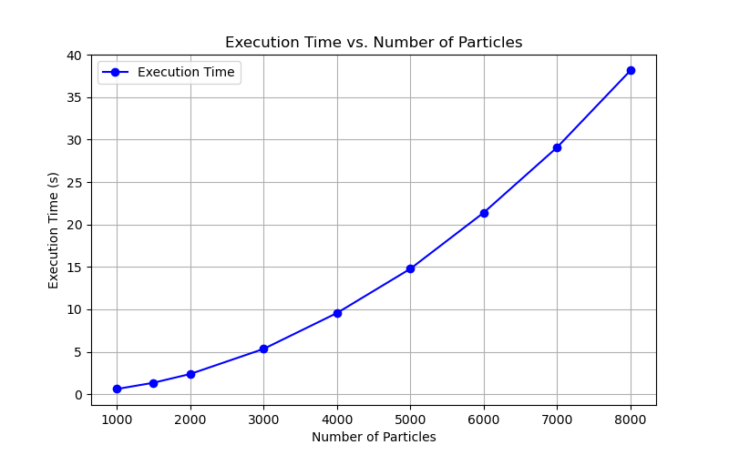
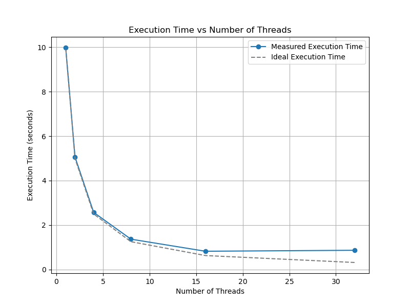
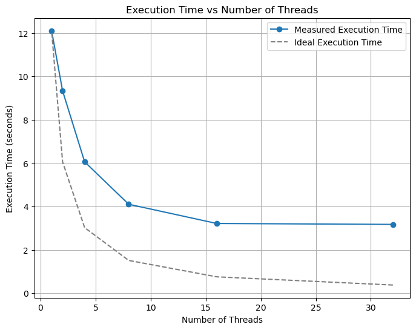

# N-Body Simulation: Profiling & Parallelization

### 📖 The Narrative: Slow $\rightarrow$ Parallel $\rightarrow$ Profiled $\rightarrow$ Optimized
Simulating a galaxy of particles requires computing the gravitational force between every pair, resulting in a massively compute-bound $\mathcal{O}(N^2)$ bottleneck. To make this scalable, I built a baseline, parallelized it, profiled the bottlenecks, and aggressively optimized the memory access patterns.

### 🛠️ Progression & Optimizations

**1. The Sequential Baseline**
- Confirmed the expected $\mathcal{O}(N^2)$ scaling (execution time perfectly quadrupling as particles doubled).
- *Optimization:* Applied Newton's Third Law to halve total force calculations and replaced expensive divisions with pre-computed inverse mass multiplications.

**2. Shared-Memory Parallelization**
- Scaled the force-computation loops across multi-core CPUs.
- Explored the overhead and synchronization tradeoffs between low-level **Pthreads** (manual condition variables and chunking) and high-level **OpenMP** (reductions and dynamic scheduling).

**3. Low-Level Profiling & Cache Tuning**
- **The Problem:** Profiling with Valgrind/Cachegrind revealed that while the math was parallel, the data fetching was inefficient.
- **The Solution:** Re-structured the data layout into an Array of Structs (AoS) to maximize spatial locality and utilized `static inline` functions for math operations. 
- **The Result:** Reached a **0.00% Instruction Cache miss rate** and virtually eliminated L1 data cache misses.

### 🚀 Results
*(Insert your scaling graphs here showing the baseline $\mathcal{O}(N^2)$ curve, followed by the flattened execution times achieved via Pthreads/OpenMP).*

### 📂 Files
- [`nbody_pthreads.c`](./nbody_pthreads.c) - Manual thread synchronization (PThreads).
