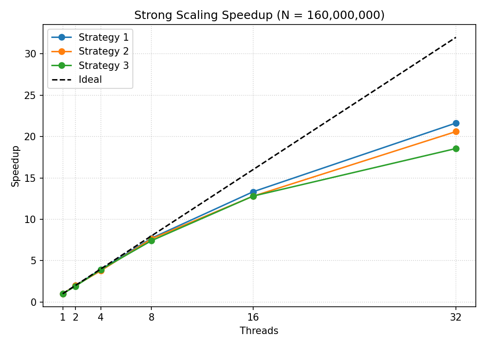
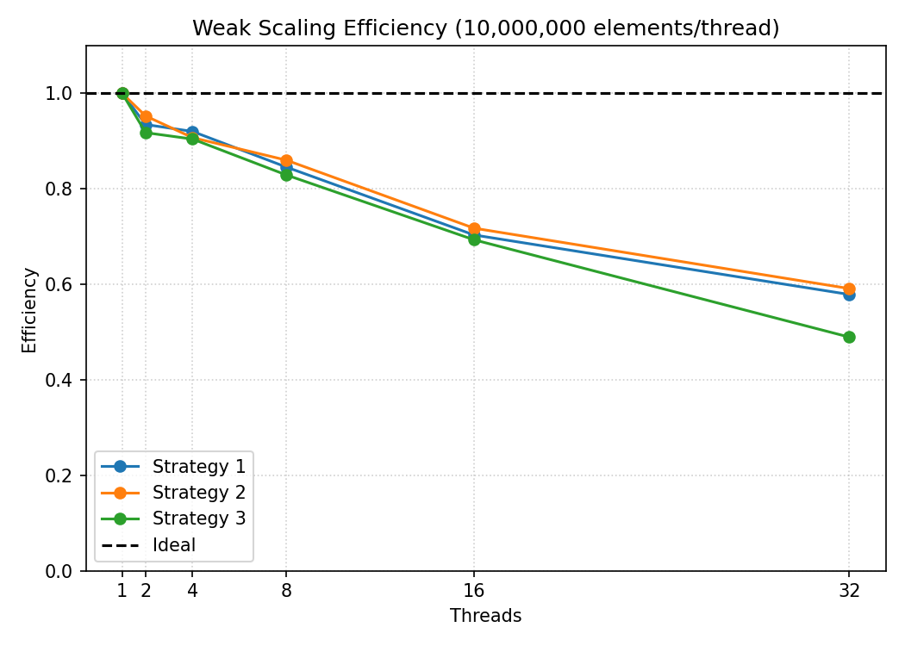

# Parallel Quicksort: Hyperquicksort Topology & NUMA Profiling

### 📖 The Narrative: Slow $\rightarrow$ Parallel $\rightarrow$ Profiled $\rightarrow$ Optimized
Sequential `qsort` is fast, but sorting 160 million elements requires massive concurrency. Instead of using a naive recursive OpenMP implementation (which explodes thread management overhead), I mapped a distributed "hyperquicksort" topology onto shared-memory, scaled it across an AMD EPYC architecture, and aggressively profiled its memory and NUMA bottlenecks.

### 🛠️ Progression & Optimizations

**1. The Hyperquicksort Translation**
- **The Problem:** Recursive `#pragma omp task` spawning creates massive overhead and destroys data locality.
- **The Solution:** Used a single, flat parallel region. Threads locally sort once, exchange partitioned data with their partners, and *merge* the incoming streams. This preserves the locally-sorted invariant and eliminates $\mathcal{O}(N \log N)$ re-sorting at every depth.

**2. Scaling & NUMA Topology Analysis**
- **Strong Scaling:** Executed on 160M elements up to 32 threads, achieving a **21.6x speedup**. Profiling isolated a distinct efficiency drop at 16 threads, tying it directly to crossing physical NUMA domain boundaries on the AMD EPYC 9454P.
- **Weak Scaling:** Assigned 10M elements per thread. Evaluated three different pivot selection strategies (e.g., median-of-medians). Proved that computational overhead grows sub-linearly with thread count, sustaining ~60% efficiency at 32 threads.

**3. Low-Level Profiling (Callgrind & Memcheck)**
- **Instruction Bottlenecks:** Callgrind proved thread synchronization was virtually perfect (`GOMP_barrier` accounted for only 1.6% of instructions). The bottleneck was purely computational math (75%) and AVX-accelerated `memcpy` operations (7.3%).
- **Memory Footprint:** Profiled Peak RSS footprint, tracking a ~4x memory overhead multiplier caused by out-of-place merge buffers, resulting in a zero-leak Memcheck validation.

### 🚀 Results
The algorithm successfully scaled across 32 cores, maintaining load balance while mapping out exact hardware topology limitations.

*Figure: Strong scaling speedup identifying the NUMA drop-off* 

*Figure: Weak scaling efficiency comparing pivot strategies.*

### 📂 Files
- [`quicksort_openmp.c`](./quicksort_openmp.c) - The hyperquicksort implementation featuring single-region parallelism, AVX memcpy merging, and median-of-medians pivot selection.
