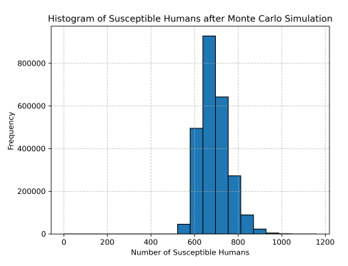
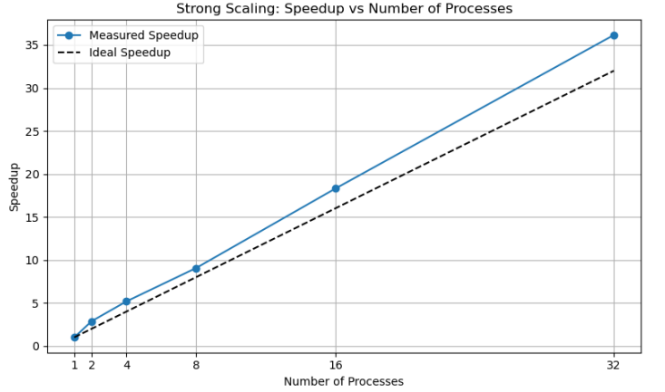
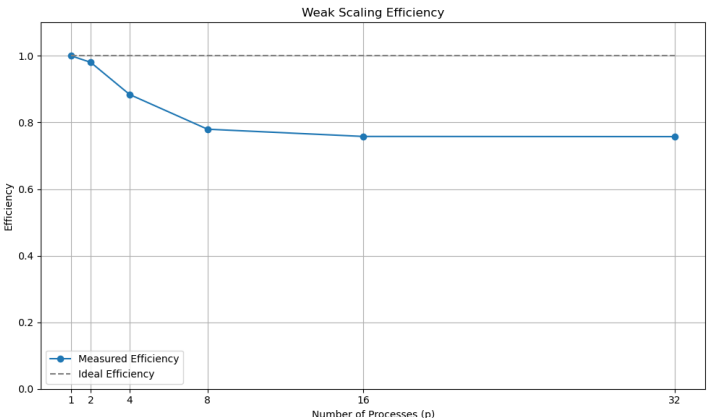

# MPI Monte Carlo Simulation: Super-Linear Scaling & SSA

### 📖 The Narrative: Stochastic Modeling $\rightarrow$ Distributed $\rightarrow$ Super-Linear Speedup
To model the spread of a malaria epidemic, I utilized the Gillespie Stochastic Simulation Algorithm (SSA) wrapped inside a Monte Carlo framework. Because stochastic experiments require millions of iterations to converge to a normal distribution, I distributed the workload across multiple physical nodes using the Message Passing Interface (MPI).

### 🛠️ Progression & Optimizations

**1. The Gillespie SSA & Monte Carlo Core**
- Implemented the Gillespie direct method to model discrete, probabilistic epidemiological events (tracking the "susceptible" human population).
- Optimized the local serial processing on each node (loop unrolling, sequential array updates) to maximize L1 cache hit rates before deploying across the cluster.

**2. Distributed MPI Parallelization & Scaling Profiling**
- Deployed the Monte Carlo experiments across up to 32 independent processes.
- **Weak Scaling:** Assigned a fixed 100,000 experiments per process. Profiling revealed efficiency gradually decayed to 0.76 at 32 processes. Analysis isolated this degradation to L3 cache and memory bandwidth contention when multiple processes shared a single CPU socket.
- **Strong Scaling & Super-Linearity:** Fixed the total workload at 500,000 experiments. The algorithm achieved a **super-linear speedup of 36.15x on 32 processes**. I traced this anomaly directly to cache utilization: as the workload subdivided, each process's data fit entirely within high-speed L1/L2 caches, eliminating DRAM latency.

### 🚀 Results
The MPI simulation successfully aggregated millions of stochastic runs into a clean Gaussian distribution, while the scaling profiles proved the underlying hardware was fully saturated.

*Figure: The normalized Gaussian distribution of the susceptible population after 2.5 million Monte Carlo iterations.*

*Figure: Strong scaling speedup demonstrating super-linear scaling*

*Figure: Weak scaling efficiency (right) profiling socket contention.*

### 📂 Files
- [`monte_carlo_mpi.c`](./main.c) - The distributed SSA implementation featuring MPI data aggregation and cache-optimized local loops.